<div align="center">

# 👋 Hey there, I'm Bhargav Mantha

### 🚀 Associate Technical Lead | Backend Architect | Kubernetes Enthusiast

<a href="https://bhargavmantha.dev"></a>
<a href="https://www.linkedin.com/in/bhargav-mantha/"></a>
<a href="https://dev.to/bhargavmantha"></a>
<a href="https://twitter.com/ManthaBhargav"></a>

```ascii
╔══════════════════════════════════════════════════════════════════════════════╗
║  💼 8+ Years Building High-Performance Backend Systems                       ║
║  🎯 Specialized in Microservices, K8s, and Healthcare Logistics Automation   ║
║  ⚡ Systems handling 800+ TPS | 73% Performance Improvements                  ║
║  🏠 Running Athena HomeLab - Multi-node K8s cluster with GPU capabilities    ║
╚══════════════════════════════════════════════════════════════════════════════╝
```

</div>

---

## 🔥 What I Do

I architect and build **scalable backend systems** that don't just work—they **perform**. Currently leading technical initiatives at **Delivery Solutions/Fox Pass Ventures**, where I'm transforming healthcare logistics through automation and intelligent workflows.

**Real Impact:**
- 🎯 Built systems processing **800+ transactions per second**
- 🚀 Achieved **73% load-balancer optimization** through intelligent routing
- 📈 Delivered **48% performance gains** in monolith-to-microservices migrations
- 🏥 Automated complex healthcare logistics workflows handling McKesson, UPS, and 15+ shipping providers
- 🔄 Designed Node-RED automation systems processing thousands of shipments daily

## 💻 Tech Arsenal

<div align="center">

### Core Stack


### Cloud & Infrastructure


### Databases & Messaging


### APIs & Integration


</div>

## 🏗️ Athena HomeLab

Running a production-grade **Kubernetes homelab** from Mumbai, because who doesn't want a mini data center at home?

```yaml
infrastructure:
  name: "Athena HomeLab"
  nodes: ["Master", "Worker-1", "Worker-2"]
  gpu: "NVIDIA GPU for ML/AI experiments"
  networking: "Dual-WAN (500Mbps + 100Mbps) with OPNsense"
  services:
    - "Kubernetes cluster (kubeadm)"
    - "GitLab CI/CD"
    - "Prometheus + Grafana monitoring"
    - "Private Docker registry"
    - "ML/DL workloads"
  fun_fact: "It's called Athena after the Greek goddess of wisdom 🦉"
```

## 🎯 Current Focus

```mermaid
graph LR
    A[Backend Engineering] -->|Mastering| B[Go Programming]
    A -->|Deep Dive| C[Distributed Systems]
    A -->|Certifying| D[CKA + CKS]
    B --> E[Platform Architect Role]
    C --> E
    D --> E
    E -->|Target| F[₹55-75 LPA in 2-3 Years]
```



- 🔭 Building complex **Node-RED workflows** for healthcare automation
- 🌱 Deep diving into **Go** and **Distributed Systems** architecture
- 📚 Reading "Designing Data-Intensive Applications" (the architect's bible)
- 🎓 Working toward **CKA** and **CKS** certifications
- 🛠️ Contributing to **NestJS** and other open-source projects
- 🧠 Exploring **compiler design** and **operating systems internals** (because why not?)

## 🎨 Side Quests

When I'm not architecting backend systems or tinkering with my homelab:

- 🖥️ Building **Athena Programming Language** - my own compiler project
- 📖 Studying **Sanskrit literature** and **Lord Shiva** devotional content
- 🎮 Gaming (primarily on **Linux** - Manjaro was my favorite, currently distro-hopping)
- 🍳 Cooking experiments (if statement works in code, it works in recipes too!)
- 🎨 Sketching and digital art
- 🗾 Learning Japanese (日本語を勉強しています)

## 📊 GitHub Stats

<div align="center">


</div>

## 📝 Latest Blog Posts

<!-- BLOG-POST-LIST:START -->
- [Errors](https://dev.to/bhargavmantha/errors-555e)
- [Running the stored procedure from NestJs](https://dev.to/bhargavmantha/running-the-stored-procedure-from-nestjs-gj0)
- [Secret to configuring the best Postgres-Nest project- Part 1](https://dev.to/bhargavmantha/secret-to-configuring-the-best-postgres-nest-project-part-1-42n4)
- [Connecting to RDS, Using DBeaver](https://dev.to/bhargavmantha/connecting-to-rds-using-dbaver-nni)
- [The secret to configuring eslint, prettier, prettier-eslint plugin in VsCode](https://dev.to/bhargavmantha/the-secret-to-configuring-eslint-prettier-prettier-eslint-plugin-in-vscode-for-angular-ts-and-js-project-51la)
<!-- BLOG-POST-LIST:END -->

➡️ [Read more on dev.to](https://dev.to/bhargavmantha)

## 🏆 Achievements & Certifications

```
✅ ML/DL Certification - IIT Delhi
✅ 8+ Years Backend Engineering Experience
✅ Built Systems handling 800+ TPS
✅ Led Microservices Migrations with 48% Performance Gains
✅ Mentored Junior Developers & Contributed to Open Source
🎯 In Progress: CKA (Certified Kubernetes Administrator)
🎯 In Progress: CKS (Certified Kubernetes Security Specialist)
🎯 In Progress: AWS Solutions Architect - Associate
```

## 💭 Philosophy

> "Build systems that scale. Write code that teaches. Learn continuously. Share generously."

I believe in:
- **Clean architecture** over clever hacks
- **Observability** from day one
- **Work-life balance** (remote work from Mumbai, family time is sacred 👨‍👩‍👧)
- **Sustainable growth** over burnout hustle
- **Open source** contributions and knowledge sharing

## 🤝 Let's Connect!

I'm always excited to discuss:
- 💡 Backend architecture and microservices patterns
- ☸️ Kubernetes and cloud-native technologies
- 🔧 DevOps and CI/CD pipelines
- 🧠 Compiler design and systems programming
- 🎯 Career growth in engineering leadership
- 🏠 Homelab setups and infrastructure

📧 Reach out on [LinkedIn](https://www.linkedin.com/in/bhargav-mantha/) or visit my [portfolio](https://bhargavmantha.dev)

---

<div align="center">

### 💼 Open to exciting opportunities in Platform/Infrastructure Architecture


**"The best time to plant a tree was 20 years ago. The second best time is now." - Ancient Proverb**

⭐ Feel free to star repositories you find interesting!

</div>
